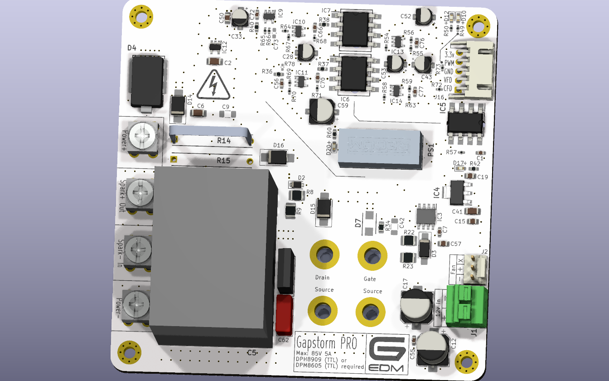
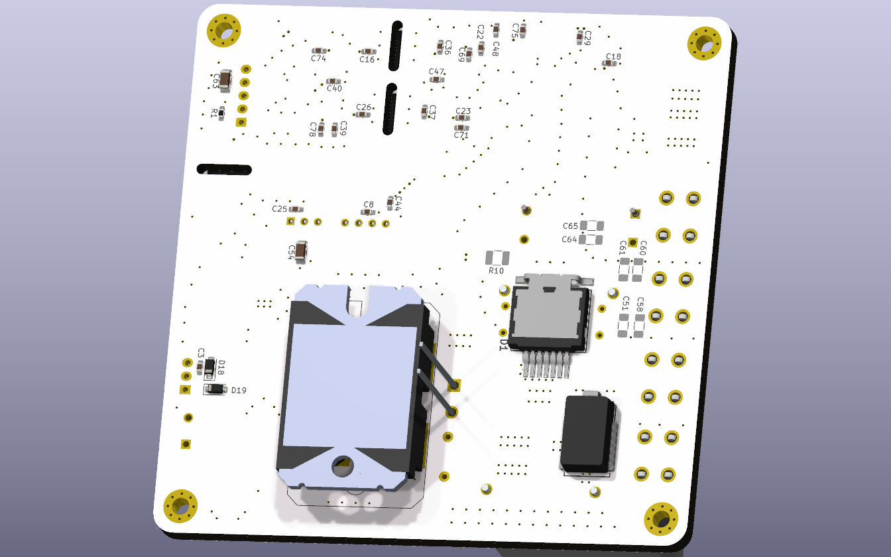
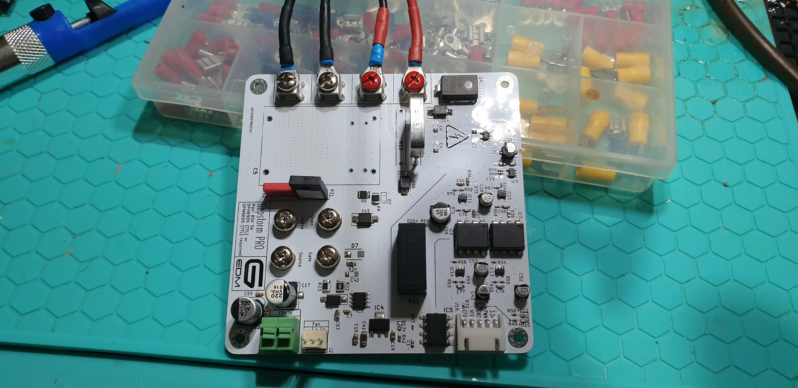
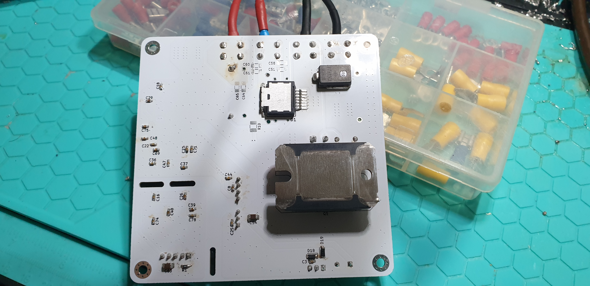

</br>
</br>
</br>

```diff
 ______     _______ ______  _______
|  ____ ___ |______ |     \ |  |  |
|_____|     |______ |_____/ |  |  |
```                                                               

</br>
</br>

# G-EDM Gapstorm Pro
</br>


</br>
</br>

The files provided on this repo are fully OpenSource. Have fun. No warranties!


# Warning

This repo contains the upgrade Gapstorm PCB files. I already assembled the board but did not yet had time for real tests. I made a short test shorting the wires at 2.5A and everything looked good. Feedback was very nice. Once I'm done testing, a link to PCBway will be provided and the max current rating published too. For people that have the initial Gapstorm PCB I recommend to change the Gate resistor against a 100R resistor as it is on this board. The Mosfet switching happens so rapid that very high inrush currents can occur that can damage the FET. Even with the 100R resistor the Mosfet is very very fast switching without visible slope on the ESP scope.

I assume the board will have no issues with 5A or maybe even 10A. I did some tests with other FETs and the 100R gate resistor did allow 10A to be used but this board has a 70uF foil cap with very low ESR. Needs more testing here before I really know the max current limit. This is no issue for wire EDM but for sinker higher current is normally wanted. 2.5 as of today is tested and safe. Once I got some cash to afford another Mosfet I will risk one to get the numbers.
</br>
</br>


# About
</br>
The Gapstorm Pro is an improved version for the switching PCB used to control the discharges for EDM machines.
</br>
The PCB is not a stand alone arc generator and requires a DPM8605 or DPH8909 as external power source.
</br>
</br>

# Features
* Mosfet low side switch
* Foil pulse capacitor
* Optically isolated voltage and current feedback
* Optically isolated PWM input
</br>
</br>


# Current and Voltage ratings

* Max input voltage on the power inputs is designed to be 80V. The board has TVS and Zener protection diodes and the input should not exceed 80v. 70V is my personal sweetspot.

* In regards of max current there is still some research that needs to be done. Depending on the Gate resistor and the Foil cap there can occur very high inrush currents that can easily destroy the Mosfet. I changed the Gate resistor to a higher value to prevent this from easily happening but have not produced real max rating data as of now. The Mosfet is expenssive and I am too broke to burn through things.  I'm working on that. 
</br>
</br>

# Wiring

* The board requires a 5P JST XH wire to connect with the motionboard

* A little 12v PSU is required for the gate drive. I use a Mean Well APV-35-12 LED 12V 2.4A for that.

* DPM/DPH positive output connects to Power+ and negative to Power-. Note that those terminals are not next to eachother on this board.

* The two center terminals are the spark terminals. Spark+ connects to the work and Spark- to the electrode.

</br>
</br>


# Important Notes and Warnings

* The Mosfet requires good cooling. It can be screwed onto a heatsick or inside a metal enclosure with the PCB just sitting on top of it.
No isolation barrier between the Mosfet and the colling component is required as the SOT227 Package already provides isolation.

* The switching section is a low side switch and thereforewhile the Mosfet is active DRAIN is switched to GND
The voltage feedback is measured from Work to Electrode using a voltage divider to scale the voltage down and feed it into a sensing circuit.
The nature of this makes a measurement in the OnTime of the switching impossible since the voltage drops close to GND and the input for the sensing circuit looks like a squarewave. This allows proximity sensing but not real gap voltage sensing and then OnTime requires to be filtered out via software.

</br>
</br>

# DPM8605 or DPH8909

* One of those devices is required as source for the spark. I recommend the DPH8909 as it allows higher voltages but the DPM8605 is ok too but limited to 60V.

* Those step down converters come with different interfaces. In order to connect them to the motionboard and have the firmware communicate with them the TTL version is required. Not the RF (Radio) or RS485! Also the baudrate needs to be set at the highest available to match the baudrate used in the firmware. See the manual for the device and search for BAUD. 115200 is what it needs to be and this number is shown on the little display as 115.2 or something.

* Set the current to 1.6A or 1.8A before the first run. This is normally the current I use and safe. Voltage either 70v or if the DPM8605 is used 60v.

</br>
</br>


# G-EDM Wiki

[A little Wiki can be found here](https://gedm.org/wiki)

</br>
</br>

